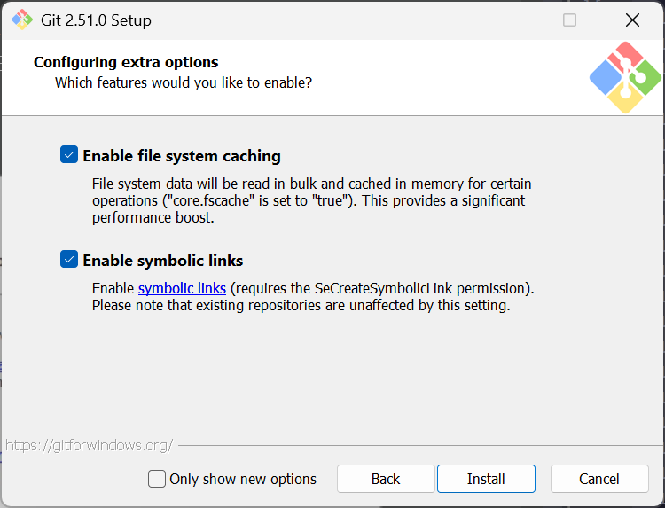

このページでは Git のインストール方法について記載します。

## 1. ダウンロード

はじめに、[Git 公式サイト](https://git-scm.com/downloads)にアクセスし、Git をダウンロードします。


自分の OS をクリックし、

Windows は x64 から、


macOS は、ターミナルを開き、

```sh
brew install git
```

でインストールできます。

Linux は規定でインストールされていることが多いですが、

```sh
# Debian/Ubuntu 系
sudo apt update
sudo apt install git
```

でインストールできます。

## 2. 設定してインストール

(ここからは、Windows 設定のみです。macOS の人はおそらく設定不要のはずです)

Windows ではダウンロードした `Git-2.**.*-64-bit.exe` 以下の画面が出ます。

---


「Next」

---


- [ ] Additional icons (デスクトップアイコンの追加)
  - [ ] On the Desktop
- [x] Windows Explorer integration (エクスプローラーで右クリックしたときに Git 関連のツールが使えるようになる)
  - [x] Open Git Bash here
  - [x] Open Git GUI here
- [x] Git LFS (Large File Support) (Git で大規模ファイルの管理ができる)
- [x] Associate .git* configration files with the default text editor (git 関連の管理ファイルをテキストエディタで利用)
- [x] Associate .sh files to be run with Bash (Linux 用のコマンドファイルを利用できるようにする)
- [ ] Check daily for Git for Windows updates
- [x] (NEW!) Add a Git Bash Profile to Windows Terminal (Windows ターミナル上で利用できるようにする)
- [x] (NEW!) Scalar (Git add-on to manage large-scale repositories) (大規模リポジトリを管理できるようにするアドオンの追加)

---


これは、Git で利用するエディターの設定です。

初期は Vim なので、Visual Studio Code (VSCode) または、Notepad (メモ帳) をおすすめします。

---


`Git init` した際のデフォルトのブランチです。

昔は `master`-`slave` (主人-奴隷) がよく使われていました。しかし、現在では差別語とされ、**`main`-`develop` (メイン-開発) が一般的**です。

そのため、上から2番目を選択し、`main` とするのが良いでしょう。

---


Git をどこでも使えるようにするか、制限するかについてです。

真ん中 (Git from the command line and also from 3rd-party software) で。

---


SSH (安全な通信に利用するシステム) を Git に付属しているものを利用するか、外部のものを利用するかです。

上 (Git に付属しているものを利用) で。

---


Https の安全な通信のために利用する仕組みです。

上 (OpenSSL) で。

---


改行コードについてです。

Windows なら一番上で。

---


Git Bash のターミナルエミュレータとして利用するものです。

上がいいらしいです。

---


`git pull` 時の動作についてです。

一番上で。

---


資格情報に関する選択です。(謎)

よくわからないですが、Git Credential Manager Core がいいらしいです。(私の Git には表示されないので、Git Credential Manager にしています)

---



便利そうなので、両方チェックで。

---


インストール中…

---


終了です。

このあとは、Git のユーザー名とメールアドレスを指定します。

## 3. Git 設定


Git Bash を起動します。


以下の方法でユーザー名とメールアドレスを指定します。

```sh
git config user.name <ユーザー名>
git config user.email <メールアドレス>

# 例
# git config user.name happy-coding
# git config user.email example@example.com
```

以下のコマンドで名前がちゃんと指定できているか確認できます。

```sh
git config user.name
# 出力例: happy-coding

git config user.email
# 出力例: example@example.com
```

以上です。
