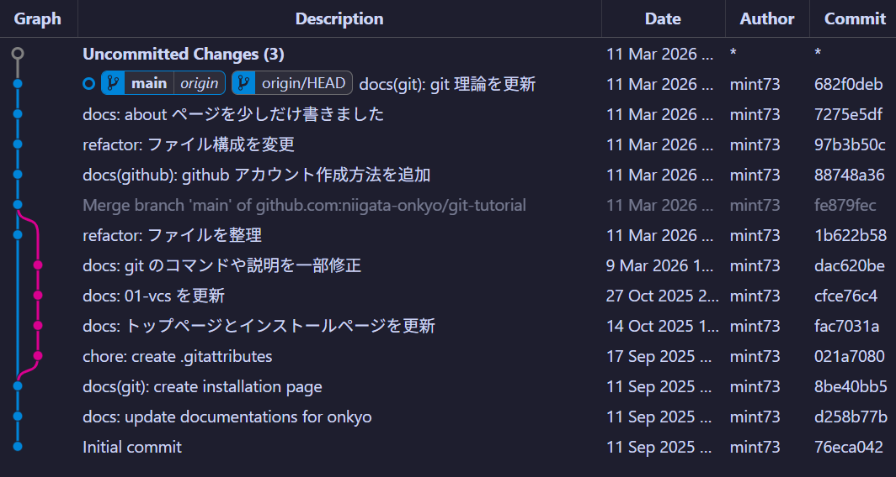

このページでは、VSCode で Git を利用する準備について記載します。

## 1. はじめに

はじめに、基本的には Git がインストールされていれば、標準の VSCode で Git を利用することができます。

そのため、この資料で記載するのは「VSCode での Git 利用をより円滑にするもの」になります。

## 2. 拡張機能のインストール

### Git Graph

以下のように Commit の日付、作者、Commit ID などが、グラフでわかりやすく見ることができます。

VSCode 標準のもの (↓) でも十分なので、正直なくても良いです。

(または、Git History や Git Lens)

### GitHub Pull Requests

通常は Pull Request を GitHub (つまりブラウザ上) で作成しますが、この拡張機能を入れることで、VSCode 内で作成できます。便利です。
