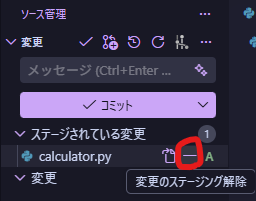
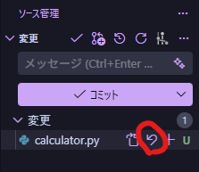
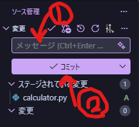

このページでは、VSCode を利用して、ステージ、コミットを行う方法を記載します。

## ステージ

### ファイルをステージする

ステージしたいファイルにマウスカーソルを合わせます。

右に `+` ボタンが表示されるので、それを押すことでファイルをステージできます。

### ステージの取り消し

ステージ後は、`-` ボタンを押すことでステージを解除できます。

### 変更の取り消し

ステージ前の状態の場合、もとに戻すボタンで変更を取り消すことができます。

ここで取り消した場合、やり直すことはできないので注意してください。

## コミット

### ファイルをコミットする

ファイルをステージしている時、コミットすることができます。

コミットする際は、メッセージを入力し、コミットボタンを押してください。

コミット後は以下のように表示されます。

