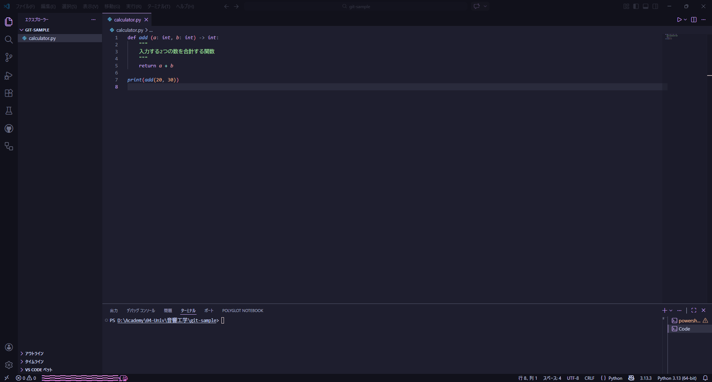
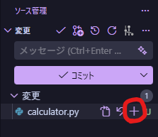
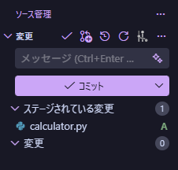

このページでは、Git の頻出コマンドを VSCode で利用する方法について記載します。

## 目次

1. 開始 (Init)
1. コミット関係
    1. Stage
    1. Commit
1. ブランチ関係
    1. Branch
    1. Checkout
    1. ブランチの削除
1. 同期関係
    1. 同期 (Fetch → Pull → Push を一括)
    1. Fetch
    1. Pull
    1. Push

## 開始/Init

## コミット関係

### ステージ

### コミット

