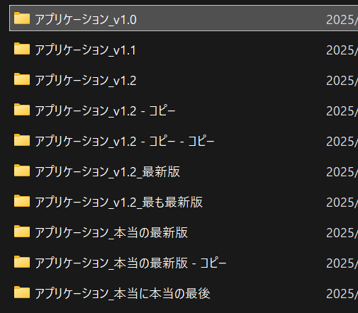
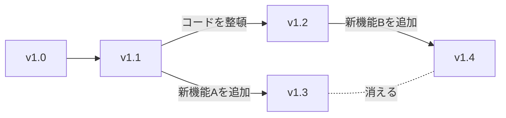

まずははじめに、こちらの画像をご覧ください。

コピーや正式なバージョン付けができなかったために、どれが本当の最新なのかがわかりません。

また、次のグラフをご覧ください。

別々の人が開発したことによって、片方の作業結果 (新機能A) が消えてしまいました。

このような経験を解消することができるのが、バージョン管理システム **Git** / **GitHub** です。

Git / GitHub では他にも様々な機能を利用することができ、それによってあなたの開発を様々な手助けになるでしょう。
