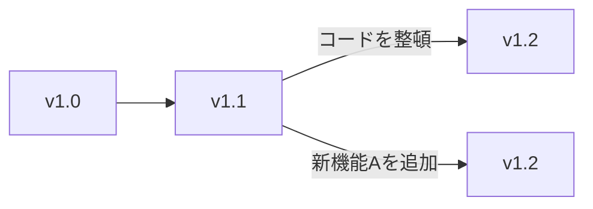
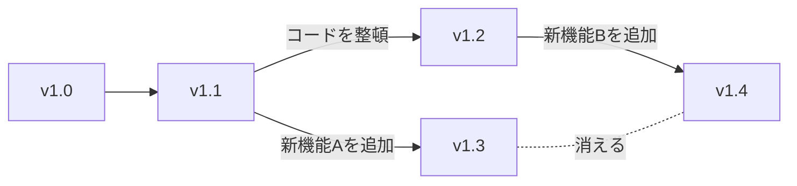
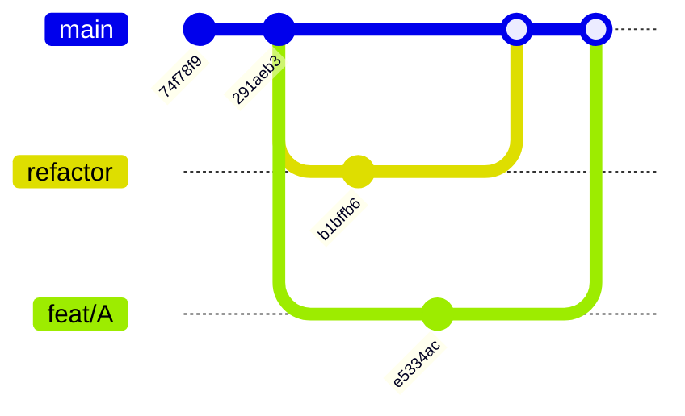

## Git を使いたい背景

### どれが最新かわからない状態

まずははじめに、こちらの画像をご覧ください。

コピーや正式なバージョン付けができなかったために、どれが本当の最新なのかがわかりません。

また、次のグラフをご覧ください。

上の v1.2 ではコード整理を、下の v1.2 では新機能Aの追加と、別のことを行っていますが、名前が被っています。

1人で開発している場合は、自分で命名規則を考え、それに則れば特に問題は起こりません。しかし、複数人で開発している場合は命名規則を忘れてしまったり、それを守っていても名前が重複する可能性が生まれます。

### 進捗の喪失

続いて、次のグラフをご覧ください。

ここでは、別々の人が開発したことによって、片方の作業結果 (新機能A) が本体に統合されることなく、消えてしまいました。

## 解決策

このような場合に役立つのが、バージョン管理システム **Git** です。

### どれが最新かわからない状態

Git では、`main`[^alt-main] (ブランチ) を軸として、開発を進めます。そのため、`main` が常に最新の開発データになります。

(リーダーが常に最新の開発データを持っているといるイメージです。ただ、Git を利用する場合は、リーダー以外も `main` を管理することができるので、作業負担の偏りを減らすことができます)

[^alt-main]: または master, develop などが利用されます

また、それぞれの保存 (コミット) ごとに、順番のない固有の ID が割り当てられます。(例: `7275e5dfbd70293f32042e5c915391ff3e0dd5d9`) そのため、バージョン名が被ることはありません。[^tags-error]

[^tags-error]: また、ローカルで tag を設定して被った場合は、重複がエラー扱いになるのでそこで気づくことができます

(下図は参考。固有 ID は上から7文字だけ表示)

(`main` が中心、`refactor` がコード整理、`feat/A` が新機能 A の開発)

### 進捗の喪失

-- 追記 --

## まとめ

Git は複数人での開発を、効率的に行える機能を提供します。

他にも様々な機能があり、それらを使いこなすことで、効率的に、安全に開発を進めることができるでしょう!
