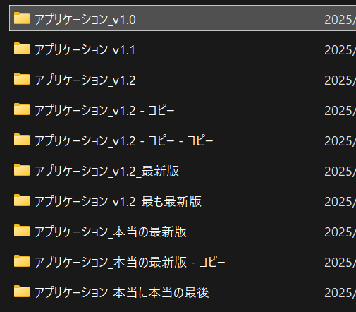
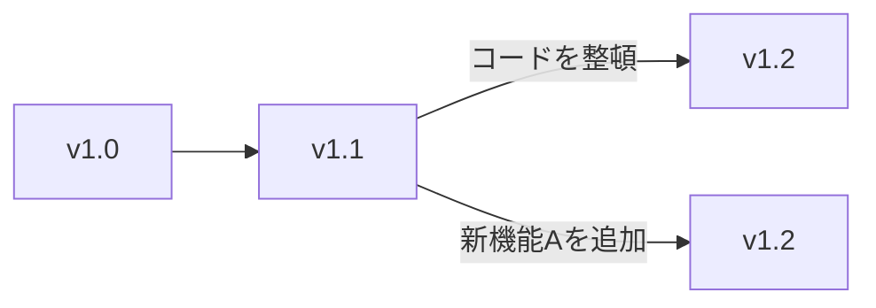
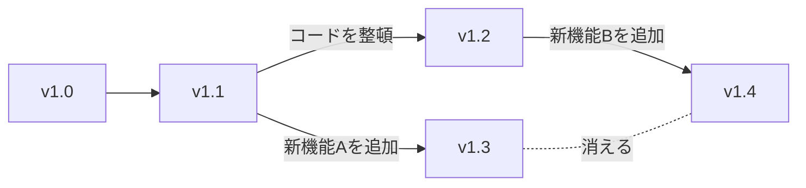
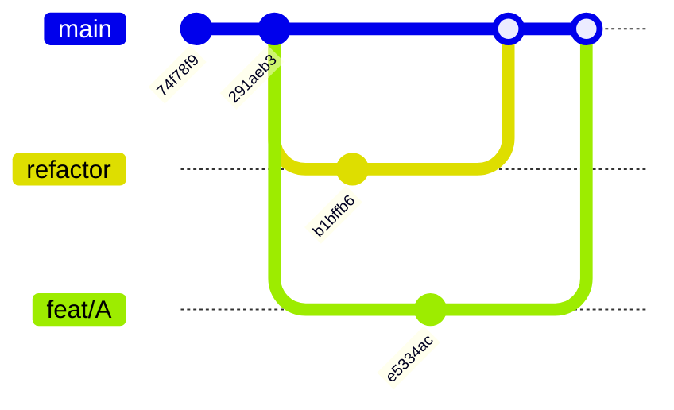

## Git を使いたい背景

### どれが最新かわからない状態

まずははじめに、こちらの画像をご覧ください。

コピーや正式なバージョン付けができなかったために、どれが本当の最新なのかがわかりません。

また、次のグラフをご覧ください。

上の v1.2 ではコード整理を、下の v1.2 では新機能Aの追加と、別のことを行っていますが、名前が被っています。

1人で開発している場合は、自分で命名規則を考え、それに則れば特に問題は起こりません。しかし、複数人で開発している場合は命名規則を忘れてしまったり、それを守っていても名前が重複する可能性が生まれます。

### 進捗の喪失

続いて、次のグラフをご覧ください。

ここでは、別々の人が開発したことによって、片方の作業結果 (新機能A) が本体に統合されることなく、消えてしまいました。

## 解決策

このような場合に役立つのが、バージョン管理システム **Git** です。

上記の問題の解決方法を以下に示します。(今後詳しく説明するので、ここでは理解できなくて大丈夫です!)

### どれが最新かわからない状態

Git では `main` を中心とし、そこから分けたり統合することで、機能を追加する方法を用います。[^ge]

[^ge]: 一般的には。master や develop にしている場合もある

機能を作る際は `main` をコピーして開発しますが、最終的に `main` に統合するため、**`main` が常に最新**になります。[^branch]

[^branch]: 厳密には (コピーではなく) branch を作成し、merge で統合することを意味している

以下のグラフでは、`main` からコード整理 (`refactor`) と 新機能 A (`feat/A`) に分けて開発し、最終的に統合している例を表しています。[^commit-id]

[^commit-id]: それぞれの Commit は順番のないランダムな ID (例: `7275e5dfbd70293f32042e5c915391ff3e0dd5d9`) を割り当てられます。

### 進捗の喪失

## まとめ

Git は (主に) 共同開発の開発をより効率的に行える機能を提供します。

また、他にも様々な機能があり、それらを使いこなすことで、効率的に開発を進めることができるでしょう!
