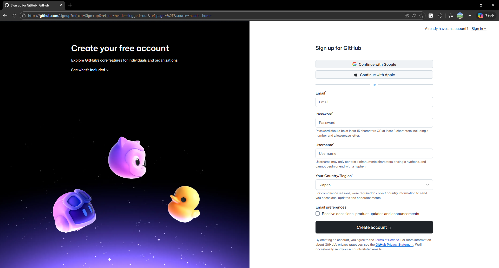
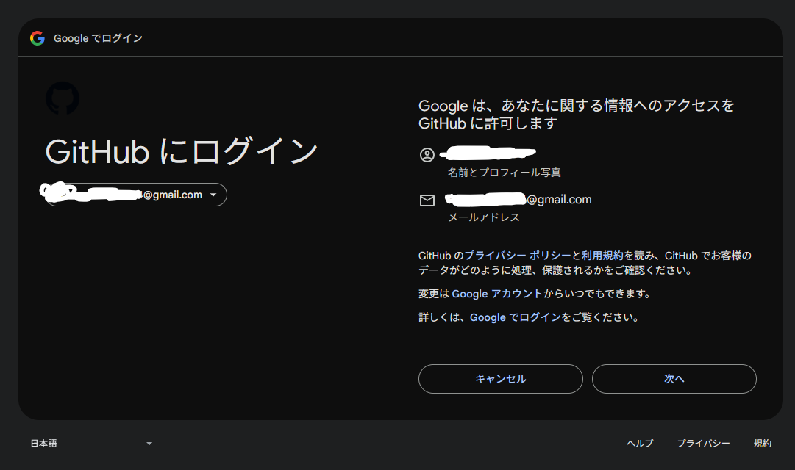
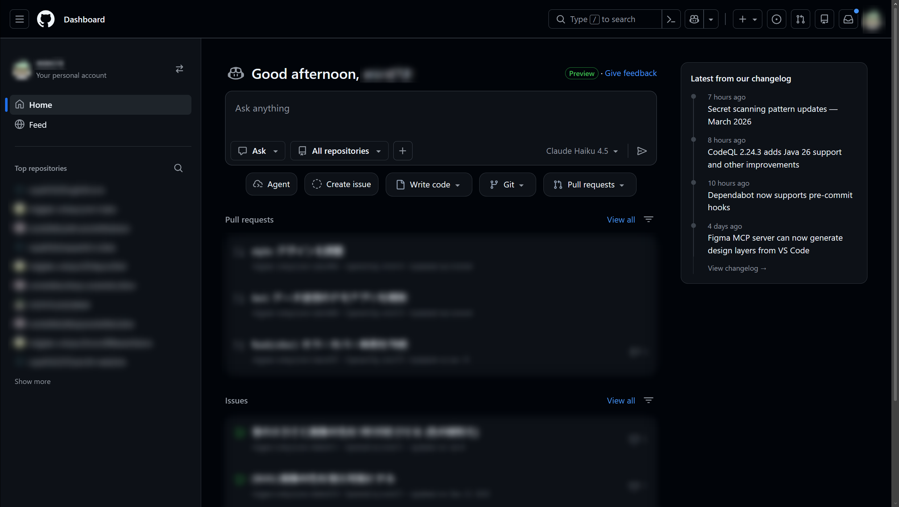

このページでは、GitHub アカウントの作成方法について記載します。

## 1. GitHub にアクセス

はじめに、GitHub にアクセスします。

<https://github.com>

アクセスすると、次の画面が表示されます。

## 2. アカウントを作成する

続いて、右上の **Sign up** を押します。

ここで、アカウントを作成します。

Google/Apple アカウントを用いるか、メールを用いてアカウントを作成してください。

Google アカウントを用いる場合は、以下のようになると思います。

## 3. アカウント作成後

アカウントが正しく作成できた場合は、以下の画面になります。

今後、GitHub は度々使うかもしれないので、ブックマーク (★) などに登録しておくといいかもしれません。
