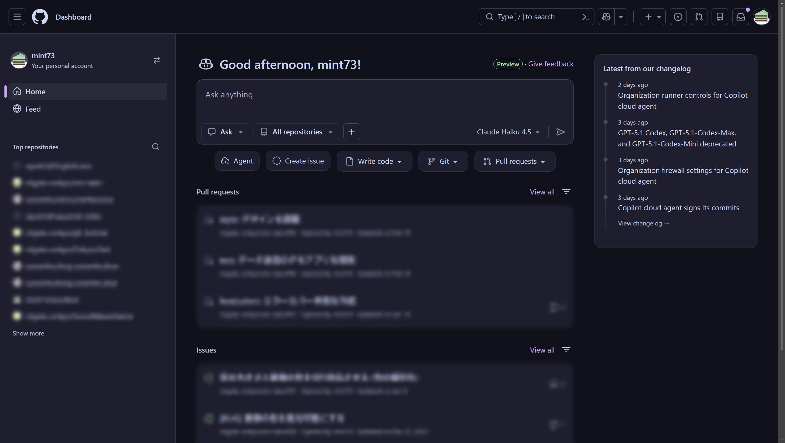
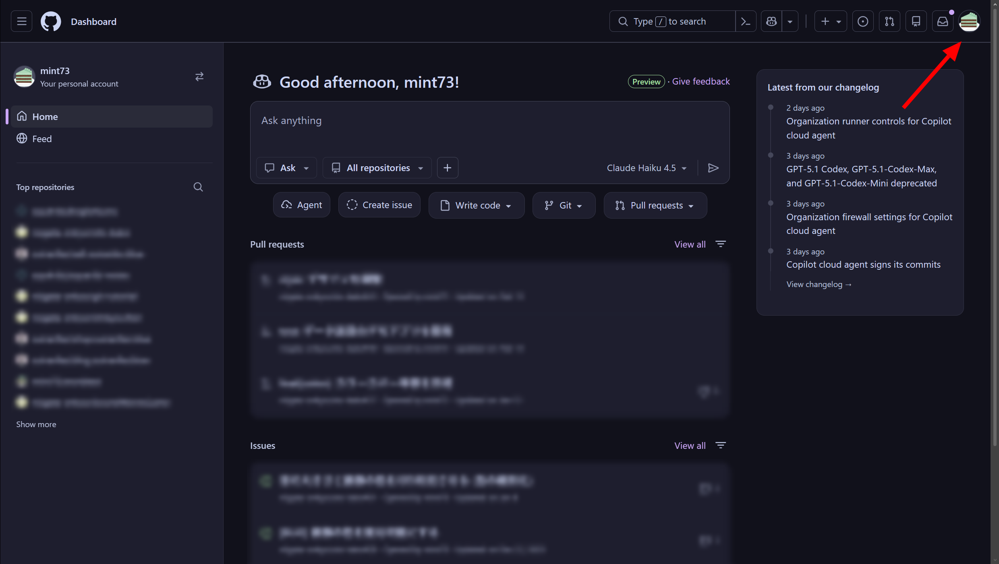
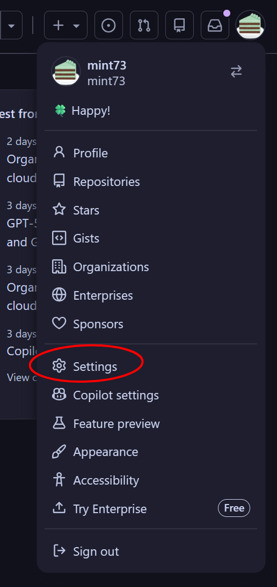
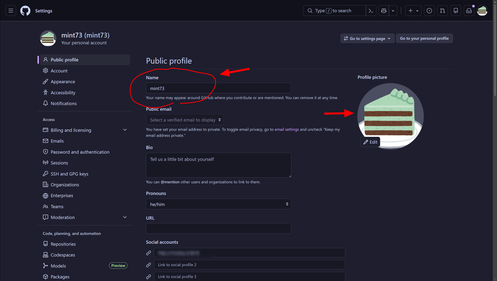

このページでは、GitHub アカウントの設定についていくつか紹介します。

(ちなみに、GitHub は**日本語設定がありません** (???)[^lang])

[^lang]: というか、英語以外ないです。詰んだ…

## 1. GitHub のトップページ

GitHub のトップページを開きます。

<https://github.com>

こちらの画面が表示されます。

## 2. 設定ページを開く

右上のアイコンをタップします。

サイドバーが開くので、Settings を開きます。

## 3. 名前・アイコン設定

表示された部分で名前とアイコンを設定できます。わかりやすい名前に変えておきましょう。

