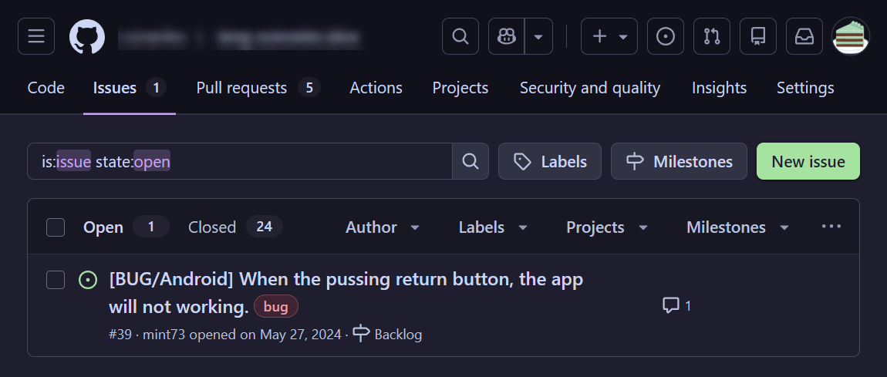
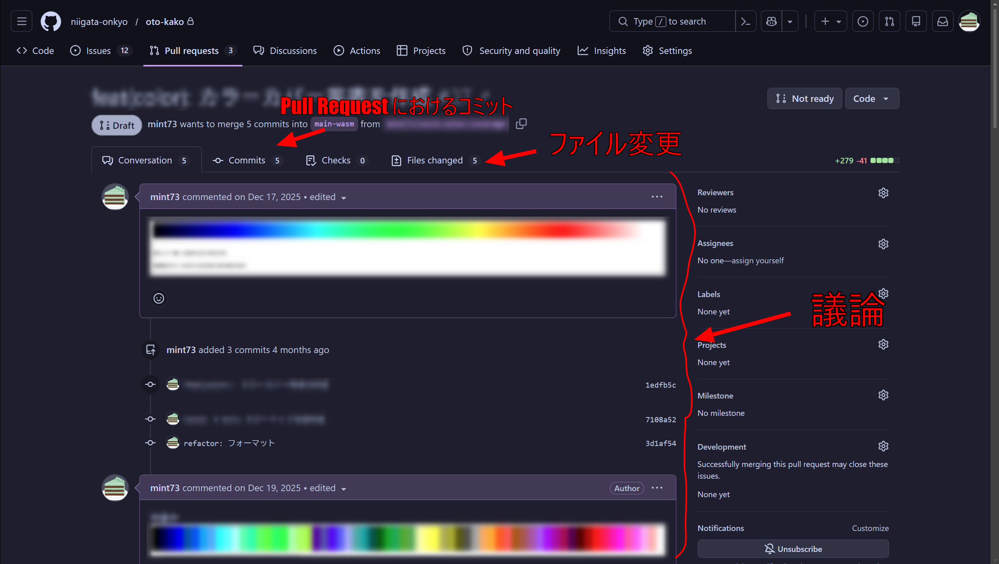

## リポジトリ

### アクセス方法

### 見方

### Issues

(*音響工学プロジェクトのローカルルール*: 簡単なバグやタイトルで分かる場合は、ほとんどまたは何も書かなくてもいいです)

### Pull Requests

#### Merge

自動で Merge 可能です。

Conflict (競合) が発生しているため、手動での修正が必要です。(やや難しいです)

### 新しいリポジトリの作成
