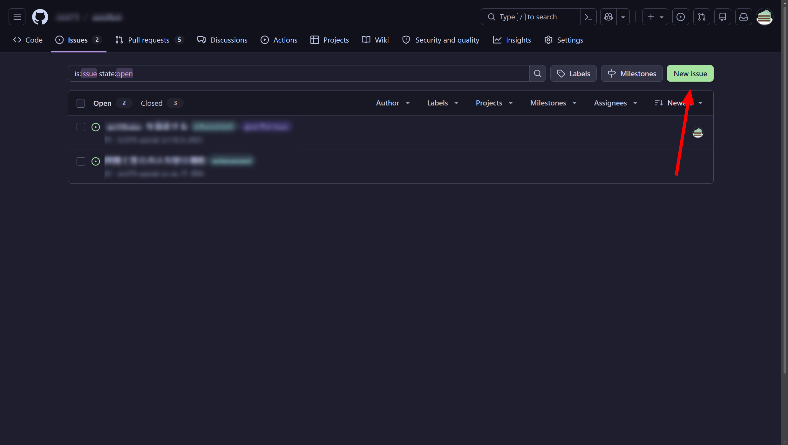
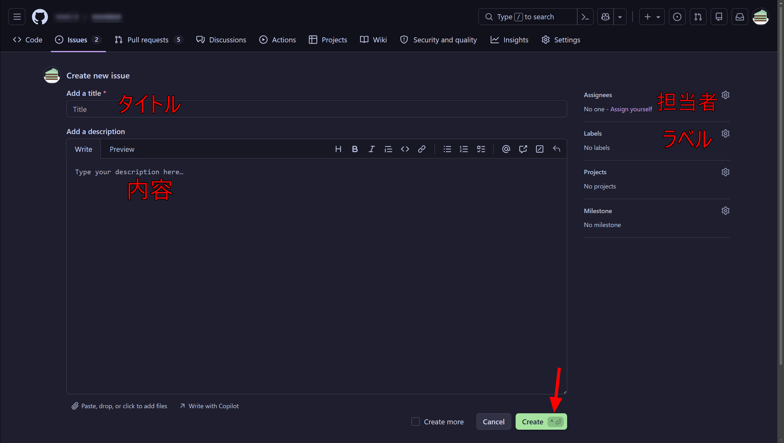
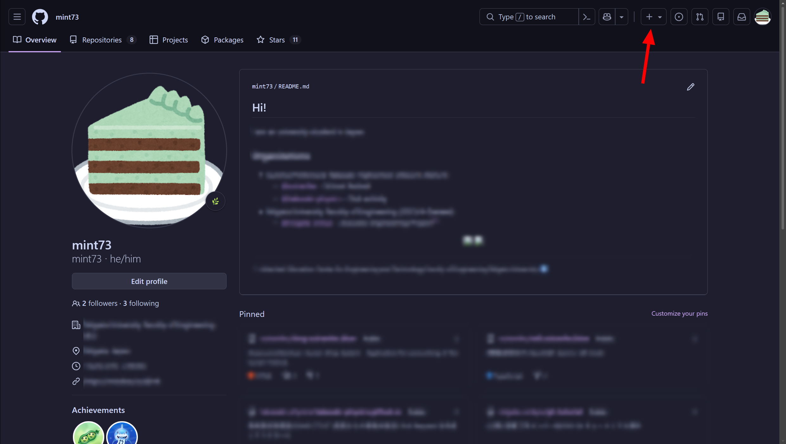

## リポジトリ

### アクセス方法

個人ページまたは組織ページ上部の Repositories タブを選択します。すると、リポジトリ一覧が表示されます。

一覧から、特定のリポジトリを開きます。

### 見方

#### リポジトリ上部

- Code - ファイル一覧を表示
- Issues - バグや欲しい新機能一覧
- Pull Requests - バグ修正・開発した新機能の統合リクエスト
- Actions - 自動化 (CI/CD)
- Projects - プロジェクトのタスク管理 (本プロジェクトではあまり使わないかも)
- Settings - アクセス権限、セキュリティー設定など

#### リポジトリ下部

以下のとおりです。

中央下部は、プログラムの説明や開発手順、ライセンスなど重要な情報がたくさん載っています。

### Issues

#### アクセス方法

リポジトリページ上部の Issues タブを開くことでアクセスできます。

#### 見方

以下のように、バグや欲しい新機能について一覧で見ることができます。

#### 詳細

それぞれ、詳細を確認することができます。以下のように見ることができます。

(*音響工学プロジェクトのローカルルール*: 簡単なバグやタイトルで分かる場合は、ほとんどまたは何も書かなくてもいいです)

#### 新しい Issue の作成

### Pull Requests

Issues と同様に、上部のタブから Pull Requests にアクセスすると見ることができます。開発した内容を統合する際に利用します。

(Pull Request は PR という略を用いることが多いです)

Issues と同様に、詳細を確認可能です。

#### 新しい Pull Request の作成

#### Merge

自動で Merge 可能です。

Conflict (競合) が発生しているため、手動での修正が必要です。(やや難しいです)

### 新しいリポジトリの作成

#### 1. 作成開始

リポジトリ一覧を開き、右上のボタンから作成します。

(個人のリポジトリ)

(組織のリポジトリ)

または、ヘッダーの + ボタンから New repository を押して作成します。

#### 2. リポジトリの初期設定

