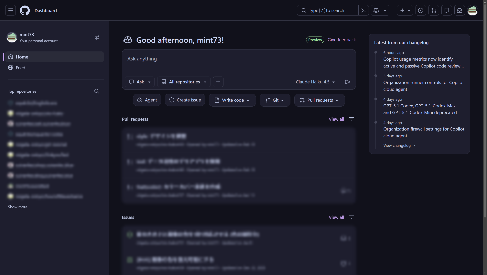
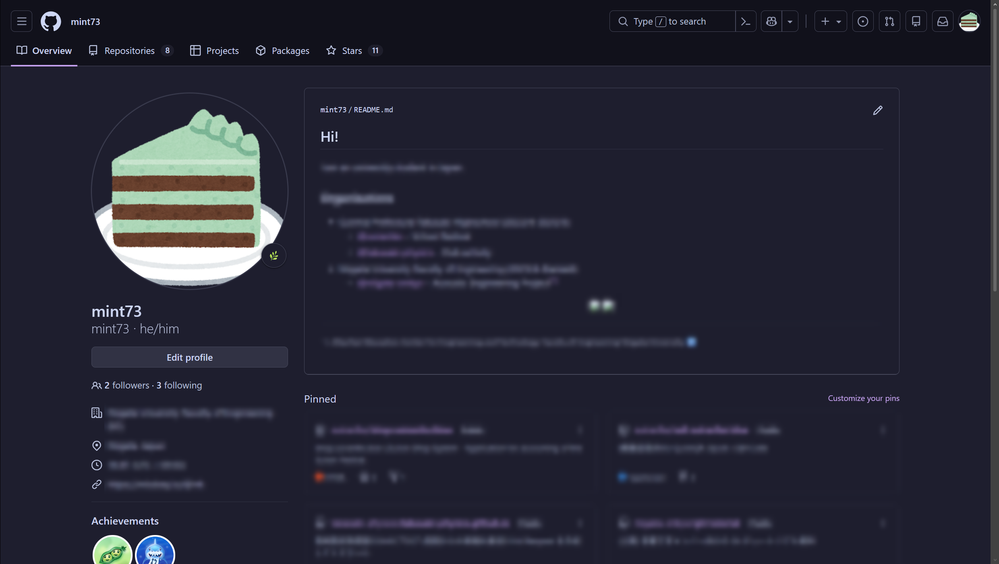
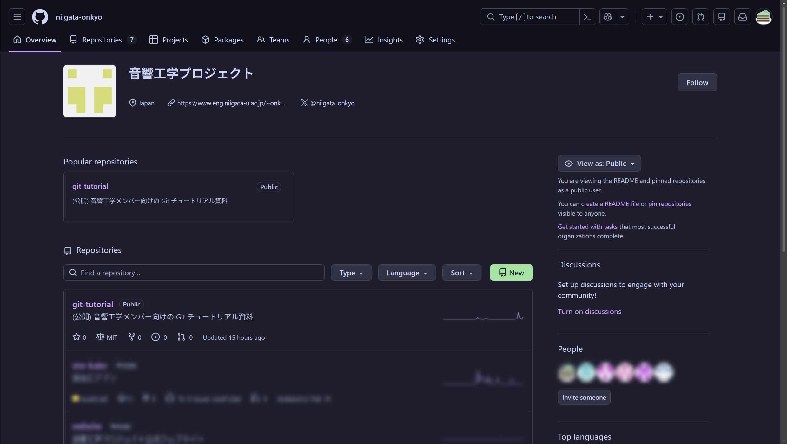
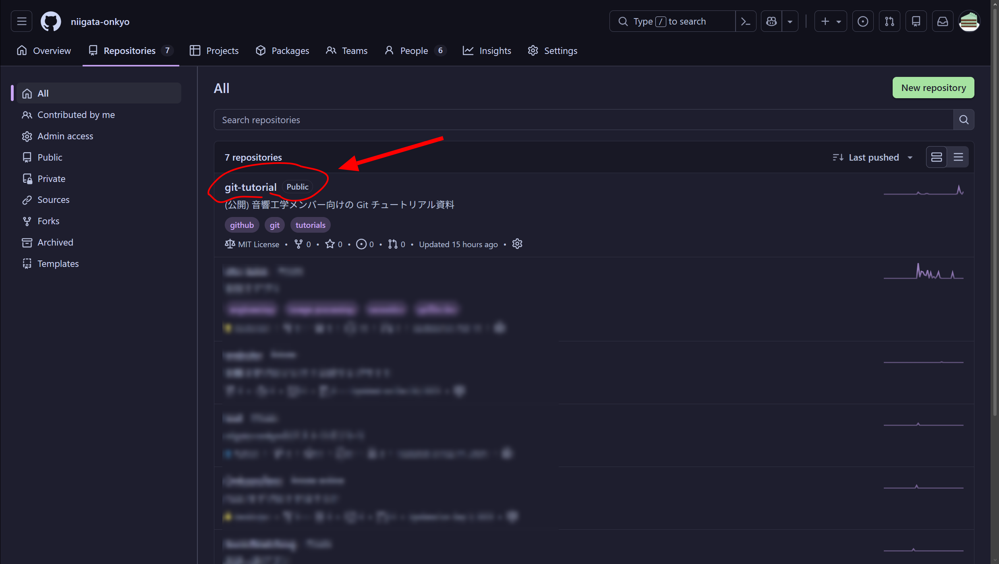
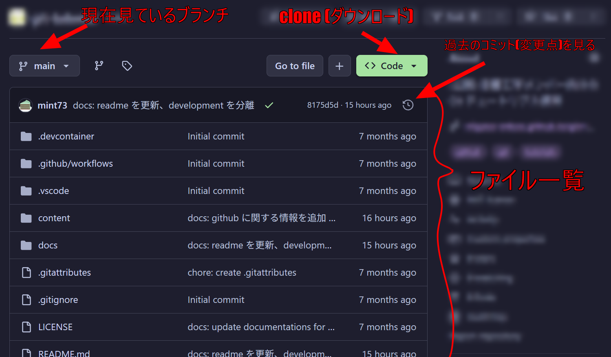
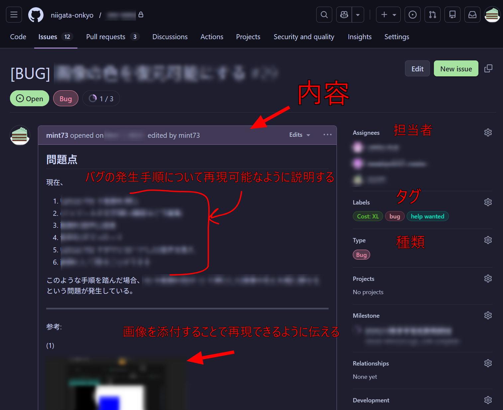
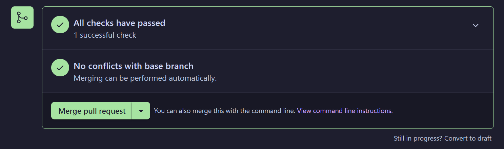
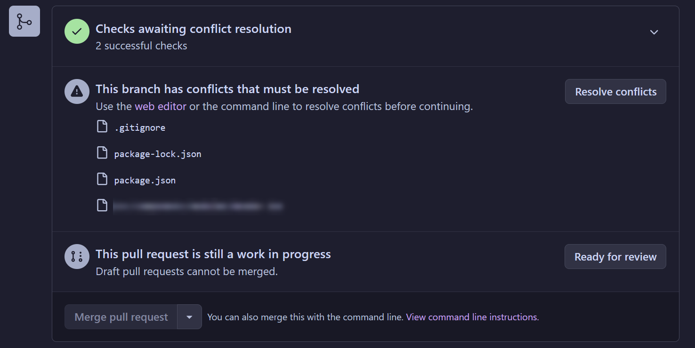

## トップ画面

### アクセス方法

<https://github.com> にアクセスする。

## 自分のページ

### アクセス方法

サイドバーを開き、Profile を選択する。

### 見方

以下の通り。

## 音響のページ

### アクセス方法

<https://github.com/niigata-onkyo> にアクセス。

または、自分のページから開く。

### 見方

自分のページとほとんど同じです。

## リポジトリ

### アクセス方法

### 見方

### Issues

(*音響工学プロジェクトのローカルルール*: 簡単なバグやタイトルで分かる場合は、ほとんどまたは何も書かなくてもいいです)

### Pull Requests

#### Merge

自動で Merge 可能

Conflict (競合) が発生しているため、手動で修正が必要 (少し難しい)

## 通知

### アクセス方法

### 見方

## その他

### 新しいリポジトリの作成

### プロジェクトの見方 (応用)

少し応用的な内容です。これを知っていたら、他の人が作ったプロジェクトの読み取りが楽になるかもしれないです。

#### 一般的なフォルダー・ファイル

よく使うフォルダー・ファイルとして、以下のものが挙げられます。(特に重要なファイルを**太字**で示しています)

| フォルダー・ファイル | 用途 |
| -- | -- |
| .github/ | GitHub 関係のファイルを格納しています。 |
| .github/copilot-instructions.md | AI に質問する際に、AI に知っておいてほしい情報を入れます。 コードを書く際のルール (インデントや改行ルール、コメント記載など) |
| .github/workflows/ | GitHub での自動化関係です。CI/CD と言われています。 |
| **docs/** | 開発で用いる資料や過去のバージョンの変更資料などを格納しています。 |
| **src/** | プログラム本体 (ソース) を入れています。 |
| tests/ | プログラムのテストを入れるフォルダーです。 |
| .editorconfig | エディターの設定をするファイルです。エディター側が自動認識していい感じにしてくれるので、特に気にしなくていいです。 |
| .gitattributes | Git のファイル扱いに関するファイルです。Git 側が認識するので、特に気にしなくていいです。 |
| .gitignore | Git で Commit を無視するファイルの設定です。アップロードしたくないファイル (機密情報ファイルや、自分用のメモ) などを設定できます。気にしなくてもいいです。 |
| LICENSE | プログラムのライセンスファイルです。プログラムを見るだけの際は、特に気にしなくていいです。 プログラムを完全に流用する場合、派生プログラムを作成したい場合などはライセンスに注意する必要があります。(本資料では割愛します) |
| **README.md** | 最も重要な資料です。プログラムの概要、目的、使い方、配布などの情報を網羅しています。 |
